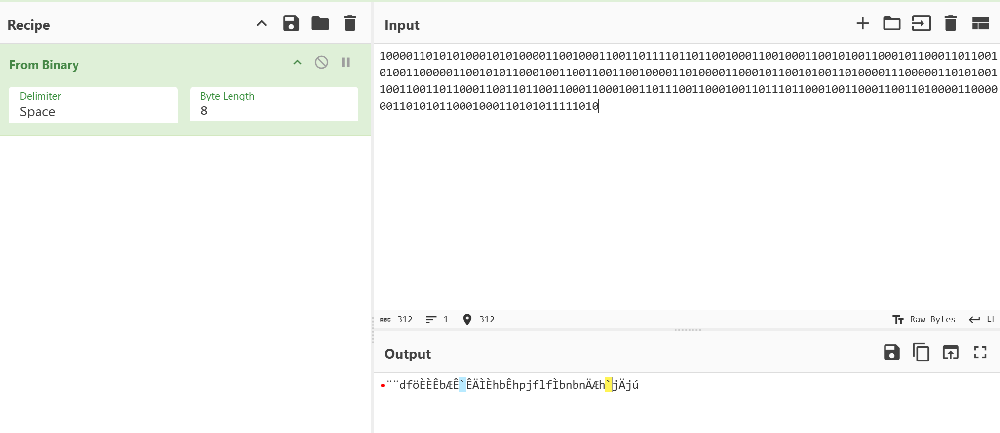
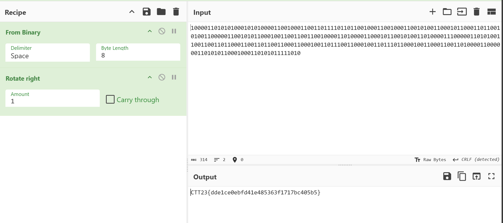

100001101010100010101000011001000110011011110110110010001100100011001010011000101100011011001010011000001100101011000100110011001100100001101000011000101100101001101000011100000110101001100110011011000110011011001100011000100110111001100010011011101100010011000110011010000110000001101010110001000110101011111010

Binary??

why we got unreadable text??

since we know flag format is CTT23{.....}
CTT =                   01000011 01010100 01010100
look at first 24bit  >> 10000110 10101000 10101000

every bit need to be rotate right by 1

so the solution should be From Binary >> rotate right

CTT23{dde1ce0ebfd41e485363f1717bc405b5}